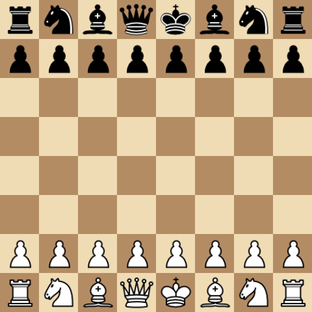

# Chessbot
A simple chess bot written in C++ with a Qt GUI.



## Intallation
Build the application with CMake.
```
git clone https://github.com/hunterwellis/Chessbot.git
cd Chessbot
mkdir build && cd build
cmake ..
make
./chess-bot # run the bot
```
## Requirements
This application uses Qt GUI (on Debian/Ubuntu):
```
sudo apt update
sudo apt-get install build-essential libgl1-mesa-dev
sudo apt install qt6-base-dev qt6-tools-dev qt6-tools-dev-tools qtcreator
```

